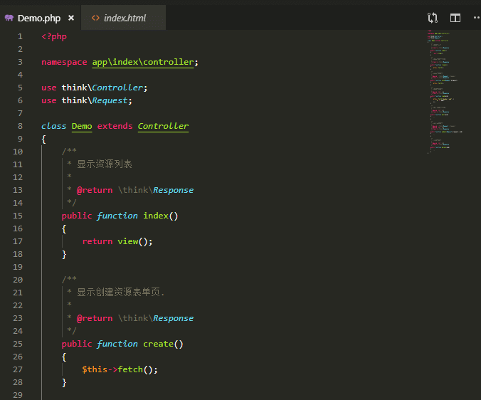
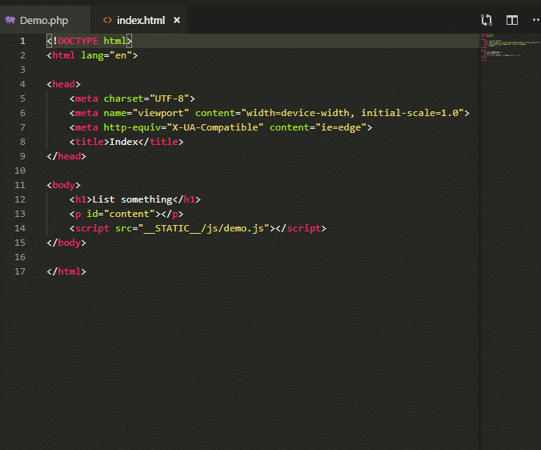

# vscode-thinkphp5 README

A vscode extension for ThinkPHP5.

## Features

* Follow the template file in project of ThinkPHP5.

* Follow the resource file in the ThinkPHP templates with the output replacement in a file path.

> Tip: The workplace must be a standard project of ThinkPHP5.

## Requirements

* PHP >= 5.6
* ThinkPHP >= 5.1

## Extension Settings

* `thinkphp5.php`: The php executable path

## Known Issues

It can't follow the dynamic template's file which is configured by `$this->view->config()`(Refer to [模板引擎](https://www.kancloud.cn/manual/thinkphp5_1/354068)).

## Release Notes

### 0.0.1

Initial release of thinkphp5. Just done the very basic functions.

### 0.0.2

Rewrite the bridge between ts and php environment. It can follow the template file which is used in the action.

**Enjoy!**
